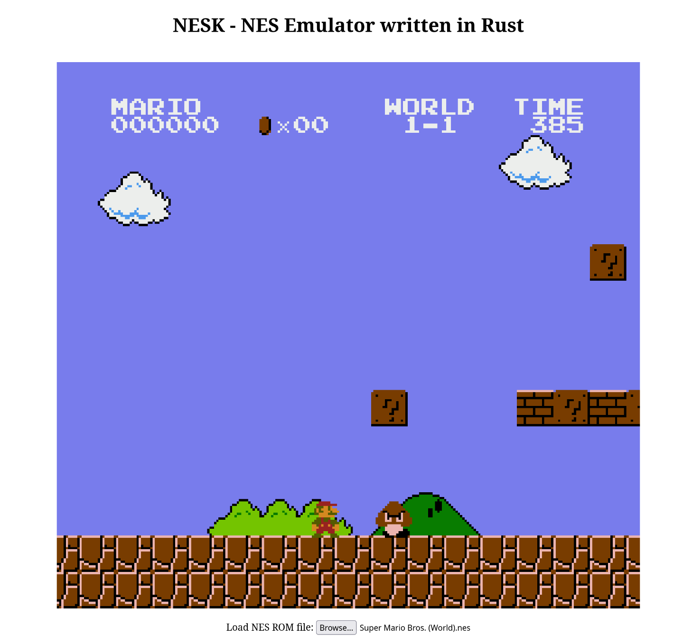

# Introduction
This is a cyclic accurate implementation of the Nintendo Entertainment System hardware, written in Rust.
With this emulator, you can play games from the NES [here](http://nesk.sanjaykenn.com).
The source code for the frontend can be found [here](https://github.com/sanjaykenn/nesk-web).

Unfortunately, due to copyright restrictions, I cannot distribute any of the ROM files to play with.

I already implemented this emulator a few years back, but since I wasn't 100% satisfied with the results, I decided to re-implement it.

# NES Specs

The emulator aims to replicate the following hardware on a cyclic-accurate level.
This is to improve the synchronization between the CPU, PPU and APU, which makes
a noticeable difference in some games.

- CPU (Ricoh 2A03)
- PPU (Picture Processing Unit)
- APU (Audio Processing Unit)
- Cartridge (NES)
- 2 KB RAM
- 2 KB VRAM

Cartridges are more than a simple read and write memory.
They have their own build in chip which can redirect the address mapping of the console.
Since each internal mapping can vary from game to game, different types of cartridges need to be emulated as well.
Currently, only Mapper 0 is implemented, but more will be added in the future.

# Todos
- Implementing further mappings to support more cartridges
- Add DMC sound channel to APU
- Add unofficial CPU instructions to support more third-party games
- Optional: various emulation features such as speedup/cheats/etc

# Sources
- [NESDev Wiki](https://www.nesdev.org/wiki/Nesdev_Wiki)
  - [Cycle accurate CPU description](https://www.nesdev.org/6502_cpu.txt)
  - [PPU description](https://www.nesdev.org/wiki/PPU)
  - [Test roms](https://www.nesdev.org/wiki/Emulator_tests)
  - [Forum](https://forums.nesdev.org/)
  - And many more pages!
- [NesHacker](https://www.youtube.com/@NesHacker)
  - A good video to start with would be [NES Architecture Explained](https://www.youtube.com/watch?v=PwZEBE66an0)

